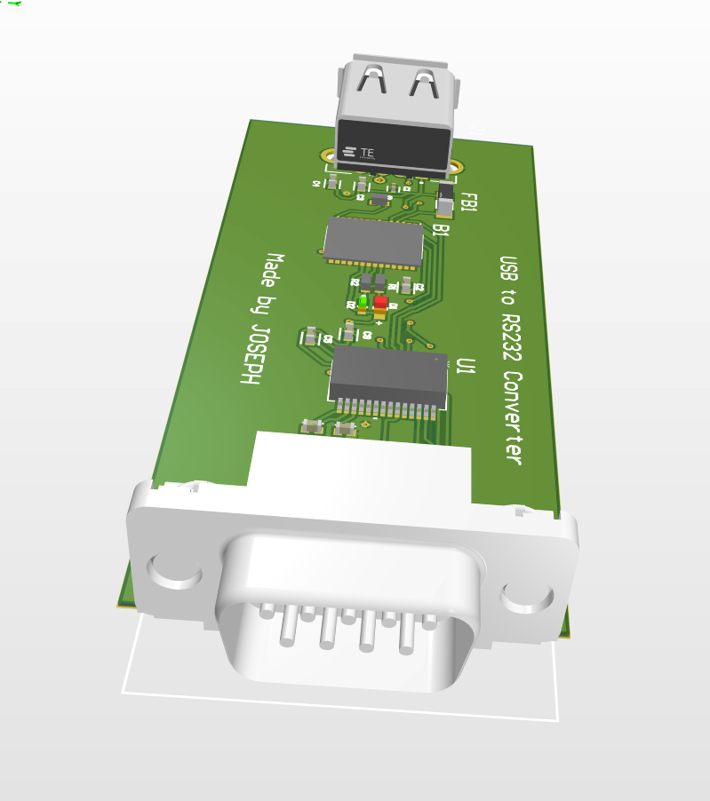
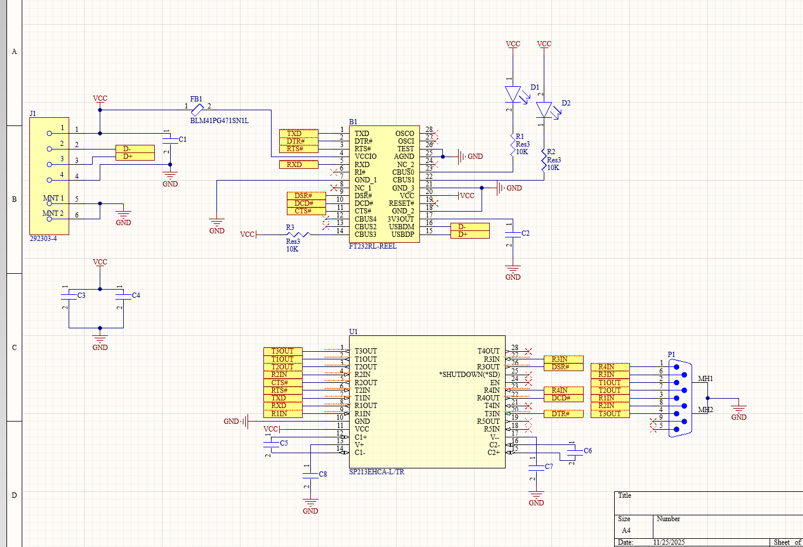
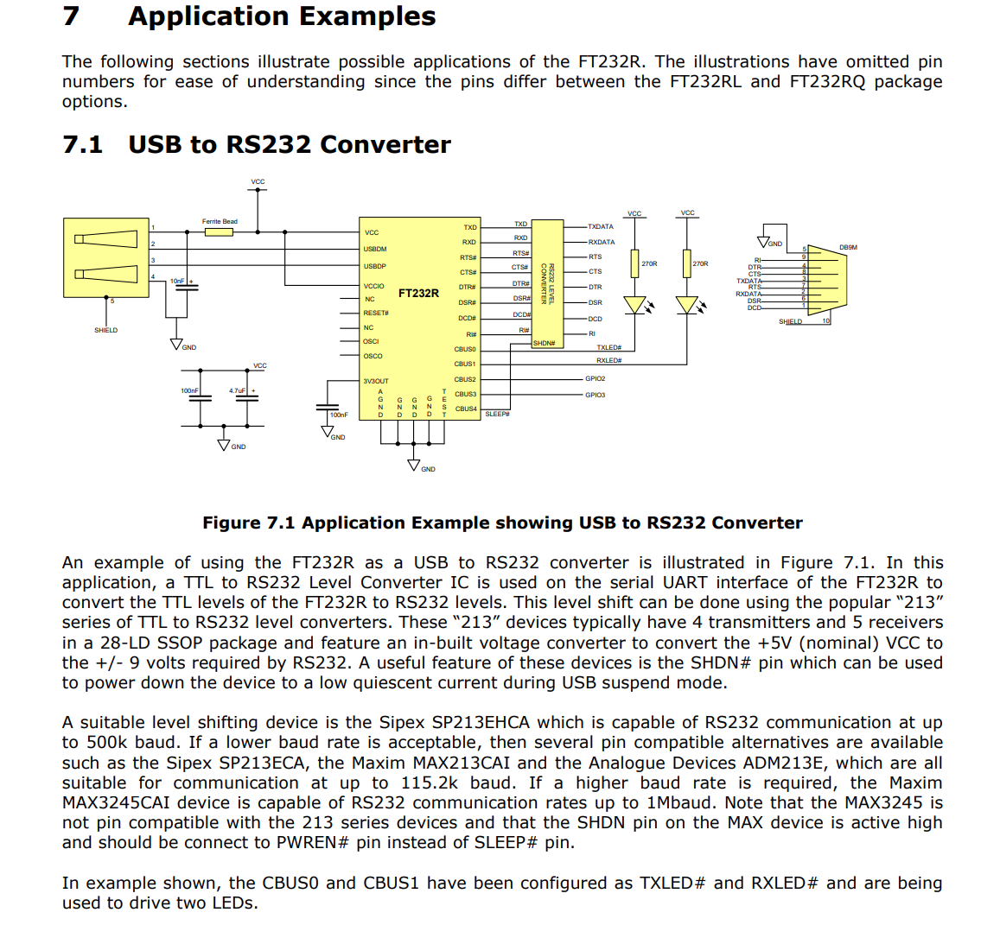
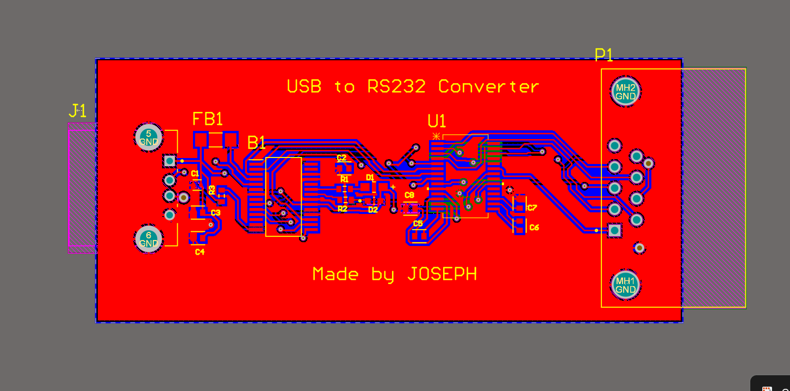
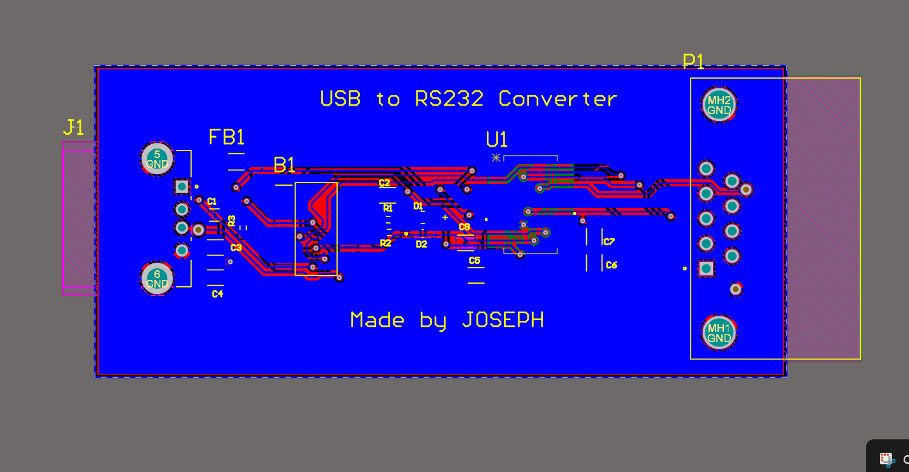
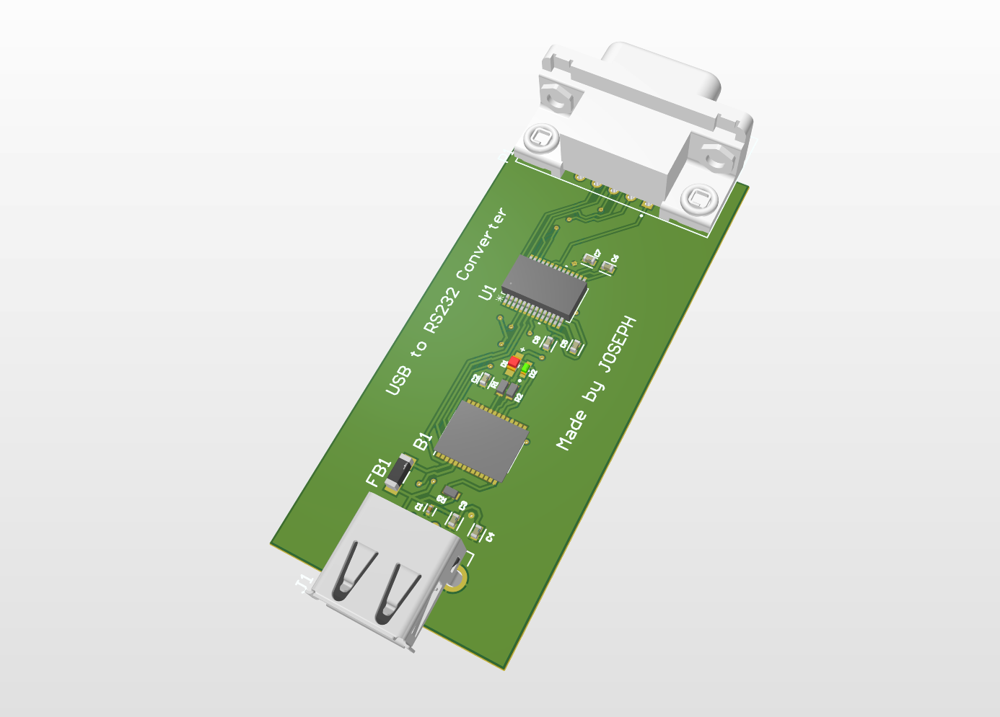
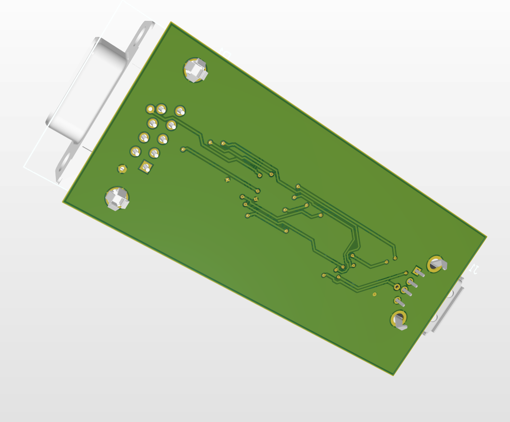

<div align="center">

# Industrial USB to RS232 Converter

### FT232RL + SP213EHCA interface board with full DB9 handshake, designed in Altium Designer

[](https://ftdichip.com/products/ft232rl/)
[](#ttl-to-rs232-sp213ehca)
[](#db9-connector)
[](https://www.altium.com/altium-designer)

**A compact bridge between modern laptops and legacy industrial equipment: PLCs, drives, sensors and test benches.**

</div>



## Why this project

In industry, many machines in service for years still rely on **RS232** for configuration, diagnostics and data exchange: PLCs, variable-speed drives, sensors, test benches. Modern laptops no longer have a native serial port, which makes field maintenance harder.

This board is a reliable, compact hardware bridge between a USB host and RS232 equipment, electrically compliant with RS232 levels (±10 V typical) and wired as a **DTE**, like a PC serial port.

| Parameter | Value |
|---|---|
| Host interface | USB (5 V bus-powered) |
| USB to UART | FTDI FT232RL |
| TTL to RS232 | SP213EHCA, internal charge pump |
| RS232 levels | ±10 V typical |
| Connector | DB9 male, DTE pinout |
| Signals | TXD, RXD, RTS, CTS, DTR, DSR, DCD, RI |
| Target baud rate | Up to 115200 baud |
| EMI filtering | Ferrite bead on USB VBUS |
| EDA tool | Altium Designer |

## System architecture

```text
              USB host (PC)
                   │  VBUS, D+, D-
                   ▼
          ┌─────────────────┐
 VBUS ───►│  Ferrite bead   │──► +5 V (filtered) ──┬────────────────────┐
          └─────────────────┘                      │                    │
                   │ D+ / D-  (90 Ω diff.)          ▼                    ▼
          ┌─────────────────────────┐   TTL   ┌─────────────────────┐   ±10 V   ┌──────────┐
          │        FT232RL          │ ──────► │     SP213EHCA       │ ────────► │   DB9    │
          │  USB  ◄──►  UART        │ TX RX   │  charge pump V+ / V-│ TXD RXD   │  male    │
          │  TX RX RTS CTS DTR DSR  │ RTS CTS │  4 x pump capacitors│ RTS CTS   │  (DTE)   │
          │  DCD RI                 │ DTR DSR │                     │ DTR DSR   │          │
          └─────────────────────────┘ DCD RI  └─────────────────────┘ DCD RI    └──────────┘
```

## Schematic



The schematic was drawn from the **FTDI** and **Exar** application notes.

### USB interface: FT232RL

- 5 V supply from USB VBUS, filtered by a ferrite bead.
- USB to UART conversion with the full set of modem lines: TX, RX, RTS#, CTS#, DTR#, DSR#, DCD#, RI#.
- Local decoupling and clean ground topology for stable operation.
- Implementation follows the FTDI datasheet reference circuit.

<details>
<summary><b>Datasheet reference: FT232R USB to RS232 application example</b></summary>



*Source: FT232R datasheet, Future Technology Devices International (FTDI). Used here for reference only. Full datasheet on the [FTDI product page](https://ftdichip.com/products/ft232rl/).*

</details>

### TTL to RS232: SP213EHCA

- Internal charge pump generates V+ and V- from 4 external capacitors (C1+, C1-, C2+, C2-).
- Handles all RS232 control lines, not only TX / RX.
- Good tolerance to load variations and EMI.

### DB9 connector

Male DB9 wired as **DTE** (industrial PC side): TXD / RXD, RTS / CTS, DTR / DSR, DCD / RI. This maximises compatibility with PLCs and field equipment.

### Reliability features

| Feature | Purpose |
|---|---|
| Ferrite bead on USB VBUS | Filters high-frequency noise entering from the host |
| 100 nF + 4.7 µF per IC | Local decoupling close to supply pins |
| DB9 shield separated from USB GND | Avoids injecting shield currents into the logic ground |
| GND polygons on top and bottom | Continuous return path, lower noise |

## PCB design

| 2D layout, top layer | 2D layout, bottom layer |
|---|---|
|  |  |

### Design rules

| Rule | Value |
|---|---|
| Minimum clearance | 0.2 to 0.25 mm (target manufacturer capabilities) |
| USB D+ / D- | 90 Ω differential pair |
| Power traces | 20 to 30 mil |
| Ground | Continuous GND polygon, top and bottom |

### Placement and routing

1. FT232RL placed so the USB lines stay **short and symmetric**.
2. SP213EHCA placed to **minimise UART trace length**.
3. DB9 on the **board edge** for mechanical alignment.
4. Critical capacitors within **3 to 5 mm** of VCC, V+ and V- pins.
5. USB differential pair routed with impedance control.
6. RS232 traces routed with enough margin to preserve signal integrity.
7. **DRC passed**: no short circuit, no clearance violation.

### Libraries

Libraries for the FT232RL, SP213EHCA, USB connector and DB9 were imported and cleaned: footprint pitch, mechanical dimensions and orientation checked, STEP models added for 3D validation.

## 3D views and fabrication

| USB side | DB9 side | Bottom |
|---|---|---|
|  |  |  |

Fabrication package prepared for a PCB manufacturer (JLCPCB, PCBWay):

- [x] Gerber files
- [x] Drill files
- [x] Pick and Place
- [x] BOM

## Project status

| Item | Status |
|---|---|
| Schematic from FTDI / Exar application notes | Done |
| Libraries and STEP models | Done |
| PCB routed, DRC clean | Done |
| Fabrication files | Done |
| Board manufactured and tested | TBD |
| Communication validated at 115200 baud | TBD |

## Applications

Industrial maintenance · PLC and drive configuration · Test bench debugging · Training labs · Industrial retrofit

## Limitations and future work

**Limitations**

- No galvanic isolation between USB and RS232: a ground loop with field equipment is possible.
- No dedicated ESD protection on USB data lines or RS232 pins.
- Bus-powered only.

**Next steps**

- [ ] Manufacture and test the board at 9600 to 115200 baud
- [ ] Add a TVS array on USB D+ / D- and RS232 lines
- [ ] Evaluate a galvanically isolated version (digital isolator + isolated DC/DC)
- [ ] Add TX / RX activity LEDs driven by the FT232RL CBUS pins
- [ ] Design a 3D-printed enclosure

## Skills

Electronic design · RS232 standard · USB to UART integration · Charge-pump level shifting · Altium libraries, PCB, 3D, DRC · Differential pair routing · EMI / EMC and decoupling · Fabrication file preparation

## Author

**Joseph Mbode**

Embedded systems engineer, electronics and PCB design.

- LinkedIn: [Joseph Mbode](https://www.linkedin.com/in/joseph-mbode)
- GitHub: [@Josephulrich](https://github.com/Josephulrich)
